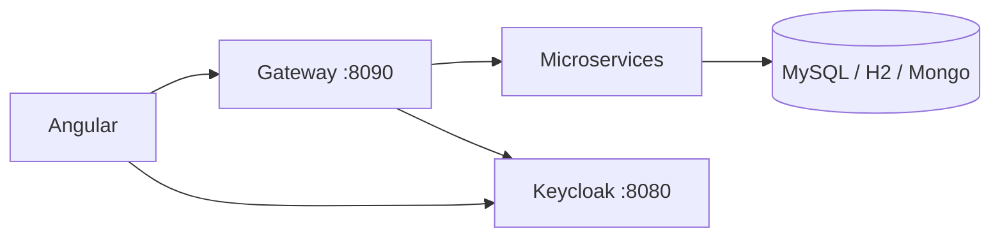

# DeliverX — Plateforme de livraison Microservices

DeliverX est une plateforme de livraison en architecture microservices : **Spring Boot 3.2.5**, **Spring Cloud** (Eureka, Config, Gateway), **Keycloak**, **Angular 19**, MySQL / H2 / MongoDB.

Documentation détaillée : http://localhost:8000 (conteneur `docs` via Docker) ou dossier [`docs/`](docs/) en local.

---

## Prérequis

| Outil | Version | Pourquoi |
|-------|---------|----------|
| **Docker Desktop** + Compose v2 | récent | Bases, Keycloak, stack complète |
| **JDK 17** | obligatoire | Spring Boot 3.x |
| **Maven** | wrapper `mvnw` inclus | Build / run local des services |
| **Node.js** | 18+ | Frontend Angular (mode local) |
| **npm** | avec Node | Dépendances frontend |
| **Git** | — | Cloner le dépôt |
| Python + pip (optionnel) | 3.x | Documentation MkDocs |

```powershell
java -version
docker --version
docker compose version
node -v
npm -v
```

---

## Démarrage rapide (Docker)

Depuis la racine du dépôt :

```powershell
docker compose up -d --build
```

Premier build : plusieurs minutes. Vérifier :

```powershell
docker compose ps
```

### URLs principales

| Service | URL |
|---------|-----|
| Eureka | http://localhost:8761 |
| Config Server | http://localhost:8888 |
| Keycloak | http://localhost:8080 (admin / admin) |
| API Gateway | http://localhost:8090 |
| Client portal | http://localhost:4200 |
| Admin portal | http://localhost:4201 |
| Documentation MkDocs | http://localhost:8000 |
| **Swagger Gateway (tous les APIs)** | **http://localhost:8090/swagger** |
| Swagger Gateway (ancien lien) | http://localhost:8090/swagger-ui.html (redirect) |
| Delivery Swagger (direct) | http://localhost:8084/swagger-ui.html |
| Tracking Swagger (direct) | http://localhost:8086/swagger-ui.html |

> Après un changement du Gateway : `docker compose up -d --build gateway` (sinon l’ancien JAR sans Swagger reste en place).

### Comptes démo Keycloak

| Utilisateur | Mot de passe | Rôle | Portail |
|-------------|--------------|------|---------|
| `admin1` | `admin123` | admin | http://localhost:4201 |
| `client1` | `client123` | user | http://localhost:4200 |

### Smoke tests Gateway

```powershell
curl http://localhost:8090/assignment/health
curl http://localhost:8090/drivers/health
curl http://localhost:8090/vehicles/health
curl http://localhost:8090/deliveries/health
curl http://localhost:8090/packages/health
curl http://localhost:8090/tracking/health
```

### Arrêt / nettoyage

```powershell
docker compose down
docker compose down -v
docker compose up -d --build --force-recreate
```

---

## Ports

### Infrastructure

| Service | Port |
|---------|------|
| Eureka | 8761 |
| Config Server | 8888 |
| Keycloak | 8080 |
| Gateway | 8090 |

### Microservices

| Service | Port | Note Docker |
|---------|------|-------------|
| assignment-service | 8081 | |
| driver-client-service | 8082 | hôte **8087** → 8082 |
| vehicle-service | 8083 | |
| delivery-service | 8084 | |
| package-service | 8085 | |
| tracking-service | 8086 | |

### Bases de données

| Conteneur | Port | Bases |
|-----------|------|-------|
| mysql | 3306 | delivery_db, driver_client_db, package_db |
| h2 | 9092 (TCP), 8082 (console) | serveur H2 |
| mongodb | 27017 | tracking_db |

### Frontends

| Portail | Port |
|---------|------|
| client-portal | 4200 |
| admin-portal | 4201 |

---

## Mode développement local (optionnel)

1. Démarrer les dépendances : `docker compose up -d mysql h2 mongodb keycloak`
2. Eureka puis Config Server (`.\mvnw.cmd spring-boot:run`)
3. Microservices (package avant delivery), puis Gateway
4. Frontend :

```powershell
cd frontend
npm install
npm run start:client
npm run start:admin
```

Détails : [docs/getting-started.md](docs/getting-started.md)

---

## Architecture (résumé)



- **OpenFeign** : assignment → delivery / driver / vehicle ; delivery → package
- **WebSocket STOMP** : tracking temps réel
- **RabbitMQ** : non utilisé dans ce projet

---

## Documentation MkDocs

Avec Docker (`docker compose up`), la doc est servie automatiquement :

**http://localhost:8000**

En local (sans le conteneur) :

```powershell
pip install mkdocs mkdocs-material pymdown-extensions
mkdocs serve
```

Ouvrir http://127.0.0.1:8000 — architecture, Docker, bases, chaque microservice, frontend, Keycloak, communication.

---

## Structure du dépôt

```
DeliverX/
├── docker-compose.yml
├── docker/                 # init MySQL, realm Keycloak
├── config-repo/            # config centralisée
├── config-server/
├── eureka-server/
├── GateWay/
├── assignment-service/
├── driver-client-service/
├── vehicle-service/
├── delivery-service/
├── package-service/
├── tracking-service/
├── frontend/               # Angular client + admin
├── docs/                   # MkDocs (sources)
├── Dockerfile.docs         # Image nginx de la documentation
├── mkdocs.yml
└── README.md
```

---

## Stack technique

| Composant | Version / techno |
|-----------|------------------|
| Spring Boot | 3.2.5 |
| Spring Cloud | 2023.0.x |
| Java | 17 |
| Keycloak | 25 |
| MySQL | 8.0 |
| MongoDB | 7 |
| H2 | embarqué / serveur Docker |
| Angular | 19 |
| OpenFeign | communication sync |
| WebSocket STOMP | tracking temps réel |
| SpringDoc | Swagger unifié au Gateway + UI par service |
