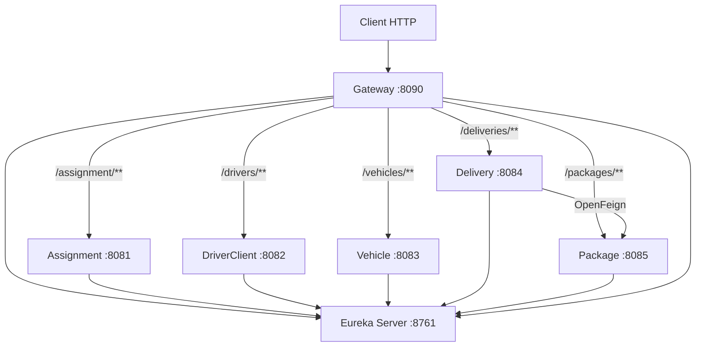
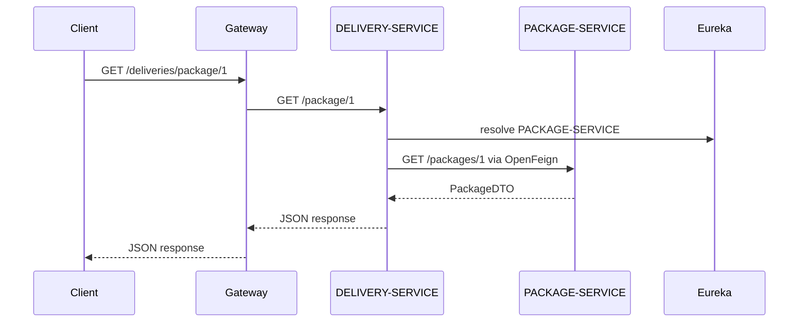

# DeliverX — Architecture Microservices

DeliverX est une plateforme de livraison construite avec **Spring Boot 3.2.5**, **Spring Cloud Gateway** et **Netflix Eureka**. L'architecture repose sur des microservices indépendants qui s'enregistrent dynamiquement auprès du serveur de découverte Eureka.

## Architecture



## Services

| Dossier | Nom Eureka | Port | Rôle | Préfixe Gateway |
|---------|------------|------|------|-----------------|
| `eureka-server/` | eureka-server | 8761 | Service Discovery | — |
| `GateWay/` | Gateway | 8090 | API Gateway (routage) | — |
| `assignment-service/` | ASSIGNMENT-SERVICE | 8081 | Gestion des affectations | `/assignment/**` |
| `driver-client-service/` | DRIVER-CLIENT-SERVICE | 8082 | Chauffeurs et clients | `/drivers/**` |
| `vehicle-service/` | VEHICLE-SERVICE | 8083 | Gestion des véhicules | `/vehicles/**` |
| `delivery-service/` | DELIVERY-SERVICE | 8084 | Gestion des livraisons | `/deliveries/**` |
| `package-service/` | PACKAGE-SERVICE | 8085 | Gestion des colis | `/packages/**` |

## Communication inter-services (OpenFeign)

**delivery-service** communique avec **package-service** via **OpenFeign** pour récupérer les informations d'un colis avant de préparer une livraison.



## Prérequis

- **JDK 17** (obligatoire — Spring Boot 3.x)
- Maven (inclus via `mvnw` / `mvnw.cmd` dans chaque projet)

Vérifier Java :

```powershell
java -version
```

## Démarrage

Lancer les services **dans cet ordre**, chacun dans un terminal séparé :

### 1. Eureka Server (obligatoire en premier)

```powershell
cd eureka-server
.\mvnw.cmd spring-boot:run
```

Dashboard : [http://localhost:8761](http://localhost:8761)

### 2. Microservices (5 terminaux)

```powershell
cd assignment-service
.\mvnw.cmd spring-boot:run
```

```powershell
cd driver-client-service
.\mvnw.cmd spring-boot:run
```

```powershell
cd vehicle-service
.\mvnw.cmd spring-boot:run
```

```powershell
cd package-service
.\mvnw.cmd spring-boot:run
```

```powershell
cd delivery-service
.\mvnw.cmd spring-boot:run
```

> **Important :** démarrer `package-service` avant `delivery-service` pour que la communication OpenFeign fonctionne.

### 3. API Gateway (en dernier)

```powershell
cd GateWay
.\mvnw.cmd spring-boot:run
```

## Visualiser les services dans Eureka

1. Ouvrir [http://localhost:8761](http://localhost:8761)
2. Cliquer sur **"Instances currently registered with Eureka"**
3. Vérifier que **6 instances** sont enregistrées :

| Application | Statut attendu |
|-------------|----------------|
| GATEWAY | UP |
| ASSIGNMENT-SERVICE | UP |
| DRIVER-CLIENT-SERVICE | UP |
| VEHICLE-SERVICE | UP |
| DELIVERY-SERVICE | UP |
| PACKAGE-SERVICE | UP |

## Tests via Gateway

| Requête | Réponse attendue |
|---------|------------------|
| `GET http://localhost:8090/assignment/health` | `{ "status": "UP", "service": "ASSIGNMENT-SERVICE" }` |
| `GET http://localhost:8090/drivers/hello` | `{ "message": "Hello from Driver & Client Service" }` |
| `GET http://localhost:8090/vehicles/health` | `{ "status": "UP", "service": "VEHICLE-SERVICE" }` |
| `GET http://localhost:8090/deliveries/hello` | `{ "message": "Hello from Delivery Service" }` |
| `GET http://localhost:8090/packages/health` | `{ "status": "UP", "service": "PACKAGE-SERVICE" }` |

## Tests OpenFeign (delivery ↔ package)

### Colis mock disponibles

| ID | Tracking | Destination | Statut |
|----|----------|-------------|--------|
| 1 | DX-TRK-001 | Tunis | READY |
| 2 | DX-TRK-002 | Sfax | IN_TRANSIT |
| 3 | DX-TRK-003 | Sousse | DELIVERED |

### 1. Package-service directement

```powershell
curl http://localhost:8085/packages/1
```

### 2. OpenFeign — delivery-service directement

```powershell
curl http://localhost:8084/package/1
```

Réponse attendue :

```json
{
  "deliveryService": "DELIVERY-SERVICE",
  "message": "Delivery prepared for package",
  "package": {
    "id": 1,
    "trackingNumber": "DX-TRK-001",
    "weight": 2.5,
    "destination": "Tunis",
    "status": "READY"
  },
  "communication": "OpenFeign -> PACKAGE-SERVICE"
}
```

### 3. OpenFeign via Gateway

```powershell
curl http://localhost:8090/deliveries/package/1
```

### 4. Cas d'erreur (colis inexistant)

```powershell
curl -i http://localhost:8084/package/99
```

Réponse attendue : **HTTP 404**

## Compilation

```powershell
cd package-service
.\mvnw.cmd package -DskipTests

cd ..\delivery-service
.\mvnw.cmd package -DskipTests
```

## Structure du dépôt

```
DeliverX/
├── .gitignore
├── README.md
├── eureka-server/
├── GateWay/
├── assignment-service/
├── driver-client-service/
├── vehicle-service/
├── delivery-service/
└── package-service/
```

Chaque dossier est un **projet Spring Boot indépendant** avec son propre `pom.xml` et wrapper Maven.

## Stack technique

| Composant | Version |
|-----------|---------|
| Spring Boot | 3.2.5 |
| Spring Cloud | 2023.0.1 |
| Java | 17 |
| Netflix Eureka | Service Discovery |
| Spring Cloud Gateway | API Gateway |
| OpenFeign | Communication inter-services |
