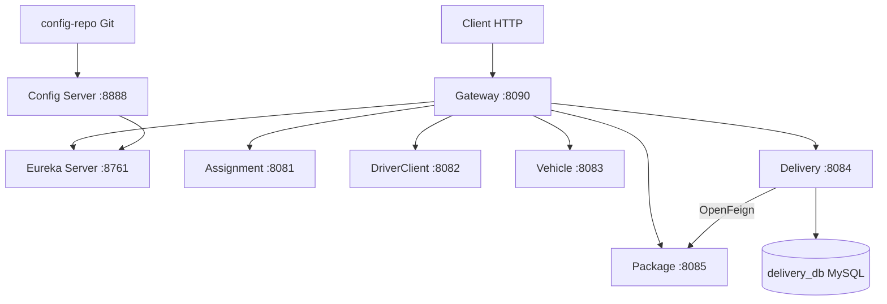

# DeliverX — Plateforme de livraison Microservices

DeliverX est une plateforme de livraison construite avec **Spring Boot 3.2.5**, **Spring Cloud Gateway**, **Netflix Eureka** et **Spring Cloud Config Server**.

## Prérequis

- **Docker** et **Docker Compose**
- **Java 17** (JDK obligatoire pour Spring Boot 3.x)
- **Maven** (ou Maven Wrapper `mvnw` / `mvnw.cmd` inclus dans chaque service)

Vérifier les installations :

```powershell
java -version
docker --version
docker compose version
```

## Architecture



Documentation complète : voir le dossier [`docs/`](docs/) ou lancer `mkdocs serve`.

## Ports et URLs

### Infrastructure

| Service | Port | URL |
|---------|------|-----|
| Eureka Server | 8761 | http://localhost:8761 |
| Config Server | 8888 | http://localhost:8888 |
| API Gateway | 8090 | http://localhost:8090 |

### Microservices

| Service | Port | URL directe | Préfixe Gateway |
|---------|------|-------------|-----------------|
| assignment-service | 8081 | http://localhost:8081 | `/assignment/**` |
| driver-client-service | 8082 | http://localhost:8082 | `/drivers/**` |
| vehicle-service | 8083 | http://localhost:8083 | `/vehicles/**` |
| **delivery-service** | **8084** | http://localhost:8084 | `/deliveries/**` |
| package-service | 8085 | http://localhost:8085 | `/packages/**` |

### Swagger (delivery-service)

| Ressource | URL |
|-----------|-----|
| Swagger UI | http://localhost:8084/swagger-ui.html |
| OpenAPI JSON | http://localhost:8084/api-docs |

### Bases de données (Docker — 3 conteneurs)

| Conteneur | Port hôte | Bases | Microservices |
|-----------|-----------|-------|---------------|
| mysql | 3306 | delivery_db, driver_client_db, package_db | delivery, driver-client, package |
| h2 | 9092 (TCP), 8082 (console) | assignment_db, vehicle_db | assignment, vehicle |
| mongodb | 27017 | tracking_db | tracking (futur) |

| Base | Utilisateur | Mot de passe |
|------|-------------|--------------|
| delivery_db | delivery_user | delivery_pass |
| driver_client_db | driver_client_user | driver_client_pass |
| package_db | package_user | package_pass |
| tracking_db | tracking_user | tracking_pass |

### Frontend (optionnel)

| Portail | Port | URL |
|---------|------|-----|
| Client Portal | 4200 | http://localhost:4200 |
| Admin Portal | 4201 | http://localhost:4201 |

## Démarrage

### 1. Démarrer les bases de données

```powershell
docker compose up -d
```

Vérifier l'état :

```powershell
docker compose ps
```

### 2. Construire les services

```powershell
cd delivery-service
.\mvnw.cmd clean package -DskipTests
```

Répéter pour les autres services si nécessaire.

### 3. Démarrer l'infrastructure Spring Cloud

Dans l'ordre, chaque service dans un terminal séparé :

```powershell
cd eureka-server
.\mvnw.cmd spring-boot:run
```

```powershell
cd config-server
.\mvnw.cmd spring-boot:run
```

### 4. Démarrer les microservices

```powershell
cd package-service
.\mvnw.cmd spring-boot:run
```

```powershell
cd delivery-service
.\mvnw.cmd spring-boot:run
```

> Démarrer `package-service` avant `delivery-service` pour la communication OpenFeign.

Puis les autres services et le Gateway :

```powershell
cd GateWay
.\mvnw.cmd spring-boot:run
```

### 5. Migration automatique (delivery-service)

Les tables MySQL sont créées automatiquement par Hibernate :

```properties
spring.jpa.hibernate.ddl-auto=update
```

Aucune migration manuelle n'est requise. Au premier démarrage, les entités `Delivery` et `DeliveryProof` génèrent les tables `deliveries` et `delivery_proofs`.

### Arrêt des conteneurs

```powershell
docker compose down
```

### Suppression des conteneurs et volumes

```powershell
docker compose down -v
```

### Reconstruction complète

```powershell
docker compose down -v
docker compose up -d --force-recreate
```

## API Delivery Service

Base URL : `http://localhost:8084/api/deliveries`

Via Gateway : `http://localhost:8090/deliveries/api/deliveries`

| Méthode | Endpoint | Description |
|---------|----------|-------------|
| GET | `/api/deliveries` | Liste paginée (filtres : status, driverId, date) |
| GET | `/api/deliveries/{id}` | Détail |
| POST | `/api/deliveries` | Créer |
| PUT | `/api/deliveries/{id}` | Modifier (PENDING uniquement) |
| PATCH | `/api/deliveries/{id}/status` | Changer le statut |
| DELETE | `/api/deliveries/{id}` | Supprimer ou annuler |
| GET | `/api/deliveries/{id}/proof` | Preuve de livraison |
| POST | `/api/deliveries/{id}/proof` | Créer une preuve |
| GET | `/api/deliveries/driver/{driverId}` | Par conducteur |
| GET | `/api/deliveries/schedule?date=YYYY-MM-DD` | Par date |

### Exemples

```powershell
curl "http://localhost:8084/api/deliveries?page=0&size=10&status=PENDING"
```

```powershell
curl -X POST http://localhost:8084/api/deliveries -H "Content-Type: application/json" -d "{\"packageId\":1,\"clientId\":1,\"driverId\":1,\"vehicleId\":1,\"pickupAddress\":\"Paris\",\"deliveryAddress\":\"Lyon\",\"scheduledDate\":\"2026-06-30T14:00:00\"}"
```

```powershell
curl -X PATCH http://localhost:8084/api/deliveries/1/status -H "Content-Type: application/json" -d "{\"status\":\"ASSIGNED\"}"
```

```powershell
curl http://localhost:8090/deliveries/health
curl http://localhost:8090/deliveries/package/1
```

## Communication inter-services (OpenFeign)

`delivery-service` appelle `package-service` via OpenFeign :

```powershell
curl http://localhost:8084/package/1
curl http://localhost:8090/deliveries/package/1
```

## Tests via Gateway

| Requête | Réponse attendue |
|---------|------------------|
| `GET http://localhost:8090/assignment/health` | `{ "status": "UP", "service": "ASSIGNMENT-SERVICE" }` |
| `GET http://localhost:8090/drivers/hello` | `{ "message": "Hello from Driver & Client Service" }` |
| `GET http://localhost:8090/vehicles/health` | `{ "status": "UP", "service": "VEHICLE-SERVICE" }` |
| `GET http://localhost:8090/deliveries/hello` | `{ "message": "Hello from Delivery Service" }` |
| `GET http://localhost:8090/packages/health` | `{ "status": "UP", "service": "PACKAGE-SERVICE" }` |

## Documentation MkDocs

```powershell
pip install mkdocs mkdocs-material
mkdocs serve
```

Ouvrir http://127.0.0.1:8000

## Structure du dépôt

```
DeliverX/
├── docker-compose.yml        # MySQL + H2 + MongoDB (3 conteneurs)
├── mkdocs.yml                # Configuration documentation
├── docs/                     # Documentation MkDocs
├── config-repo/              # Configuration centralisée
├── config-server/
├── eureka-server/
├── GateWay/
├── assignment-service/
├── driver-client-service/
├── vehicle-service/
├── delivery-service/         # CRUD livraisons + MySQL
├── package-service/
└── frontend/                 # Angular 19
```

## Stack technique

| Composant | Version |
|-----------|---------|
| Spring Boot | 3.2.5 |
| Spring Cloud | 2023.0.1 |
| Java | 17 |
| MySQL | 8.0 (delivery-service) |
| MongoDB | 7 (tracking-service, futur) |
| H2 | vehicle-service, assignment-service |
| Netflix Eureka | Service Discovery |
| Spring Cloud Config | Configuration centralisée |
| Spring Cloud Gateway | API Gateway |
| OpenFeign | Communication inter-services |
| SpringDoc OpenAPI | Swagger UI (delivery-service) |
