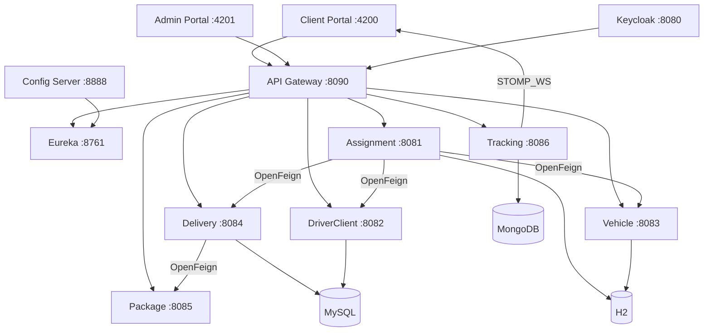

# Architecture

DeliverX repose sur Spring Cloud pour la découverte de services, la configuration centralisée, le routage API et l'authentification JWT via Keycloak.

## Vue d'ensemble

## Flux d'une requête

1. Le navigateur appelle le **Gateway** (`:8090`) avec éventuellement un Bearer JWT Keycloak.
2. Le Gateway valide le JWT (mutations) et route via Eureka (`lb://SERVICE-NAME`).
3. Le microservice cible traite la requête (JPA / Mongo / mock).
4. Les appels inter-services passent par **OpenFeign** (résolution Eureka).
5. Le tracking temps réel utilise **WebSocket STOMP**.

## Ports

| Composant | Port | URL |
|-----------|------|-----|
| Eureka | 8761 | http://localhost:8761 |
| Config Server | 8888 | http://localhost:8888 |
| Keycloak | 8080 | http://localhost:8080 |
| Gateway | 8090 | http://localhost:8090 |
| assignment-service | 8081 | http://localhost:8081 |
| driver-client-service | 8082 (Docker host **8087**) | http://localhost:8082 |
| vehicle-service | 8083 | http://localhost:8083 |
| delivery-service | 8084 | http://localhost:8084 |
| package-service | 8085 | http://localhost:8085 |
| tracking-service | 8086 | http://localhost:8086 |
| client-portal | 4200 | http://localhost:4200 |
| admin-portal | 4201 | http://localhost:4201 |

## Routes Gateway

| Préfixe | Service Eureka | Strip prefix |
|---------|----------------|--------------|
| `/assignment/**` | ASSIGNMENT-SERVICE | oui |
| `/drivers/**` | DRIVER-CLIENT-SERVICE | non |
| `/clients/**` | DRIVER-CLIENT-SERVICE | non |
| `/vehicles/**` | VEHICLE-SERVICE | non |
| `/deliveries/**` | DELIVERY-SERVICE | oui |
| `/packages/**` | PACKAGE-SERVICE | non |
| `/tracking/**` | TRACKING-SERVICE | oui |
| `/ws/**` | TRACKING-SERVICE | non |
| `/aggregated-docs/{service}` | OpenAPI de chaque MS | rewrite → `/api-docs` |

## Swagger unifié

UI unique : **http://localhost:8090/swagger**  
Ancien lien : http://localhost:8090/swagger-ui.html (redirige vers `/swagger`)

Le menu déroulant liste assignment, driver-client, vehicle, delivery, package et tracking.

Après modification du Gateway : `docker compose up -d --build gateway`

Si Swagger affiche **Service Unavailable /aggregated-docs/...** : le microservice n’est pas enregistré dans Eureka. Vérifier http://localhost:8761 puis `docker compose restart <service>`.

## Sécurité

- **GET** et **OPTIONS** : publics sur le Gateway
- **POST / PUT / PATCH / DELETE** : JWT Bearer obligatoire (Keycloak realm `deliverx`)
- Rôles applicatifs : `admin`, `user` (client Keycloak `driver-client-service`)

Voir [Authentification Keycloak](auth-keycloak.md).
