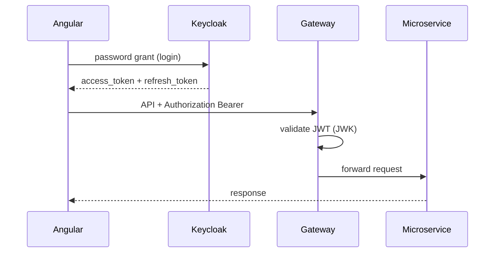

# Authentification Keycloak

DeliverX centralise l'identité avec **Keycloak 25**. Le Gateway agit comme resource server OAuth2/JWT ; le frontend obtient des tokens via Resource Owner Password Grant.

## Composants

| Élément | Valeur |
|---------|--------|
| URL | http://localhost:8080 |
| Realm | `deliverx` |
| Admin console | admin / admin |
| Import | [`docker/keycloak/deliverx-realm.json`](../docker/keycloak/deliverx-realm.json) |

## Clients OAuth

| Client ID | Type | Redirect / usage |
|-----------|------|------------------|
| `admin-portal` | public | http://localhost:4201/* |
| `client-portal` | public | http://localhost:4200/* |
| `driver-client-service` | confidential | Porte les rôles `admin` / `user` |

Les rôles applicatifs sont lus dans le JWT sous :

```
resource_access['driver-client-service'].roles
```

## Utilisateurs démo

| Username | Password | Rôle | Portail |
|----------|----------|------|---------|
| admin1 | admin123 | admin | Admin portal |
| client1 | client123 | user | Client portal |

## Flux



## Règles Gateway

Fichier `GateWay/.../SecurityConfig.java` :

- **OPTIONS** + tous les **GET** → `permitAll`
- Mutations (POST, PUT, PATCH, DELETE) → JWT authentifié obligatoire
- Issuer : `http://localhost:8080/realms/deliverx`

En Docker, le Gateway utilise `http://keycloak:8080/.../certs` pour le JWK Set tout en gardant l'issuer localhost (compatible avec les tokens émis pour le navigateur).

## driver-client-service

Ce service valide aussi le JWT et applique des contrôles de rôle (écritures souvent réservées à `ADMIN`). Endpoint profil client : `GET/PUT /clients/me` (utilisateur authentifié).

## Frontend

- `provideKeycloak` + `includeBearerTokenInterceptor` uniquement pour `http://localhost:8090/**`
- `KeycloakSessionService` : login password, refresh, logout, restauration sessionStorage
- Guards : `roleGuard('ADMIN')` / rôle `user` sur le client portal

## Obtenir un token (curl)

```powershell
curl -X POST "http://localhost:8080/realms/deliverx/protocol/openid-connect/token" `
  -H "Content-Type: application/x-www-form-urlencoded" `
  -d "grant_type=password&client_id=admin-portal&username=admin1&password=admin123"
```

Utiliser `access_token` :

```powershell
curl -X POST http://localhost:8090/vehicles/create `
  -H "Authorization: Bearer <access_token>" `
  -H "Content-Type: application/json" `
  -d "{ ... }"
```
