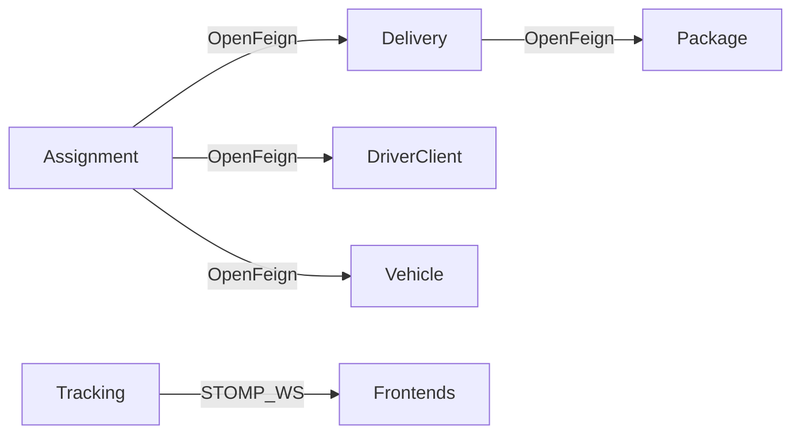

# Communication inter-services

DeliverX utilise deux mécanismes de communication :

1. **OpenFeign** — appels HTTP synchrones entre microservices (via Eureka)
2. **WebSocket STOMP** — diffusion temps réel des positions de tracking

!!! warning "RabbitMQ"
    **RabbitMQ n'est pas implémenté** dans ce projet. Il n'y a ni broker AMQP, ni files, ni `@RabbitListener`. La messagerie asynchrone n'est pas utilisée ; le temps réel repose uniquement sur WebSocket STOMP côté tracking-service.

## Vue d'ensemble



---

## OpenFeign

OpenFeign déclare des interfaces Java annotées `@FeignClient(name = "EUREKA-NAME")`. Eureka résout l'instance cible ; l'appel est un HTTP REST classique.

### delivery-service → package-service

| Élément | Valeur |
|---------|--------|
| Client | `PackageClient` |
| Eureka | `PACKAGE-SERVICE` |
| Appel | `GET /packages/{id}` |
| Usage | Démo orchestration `GET /package/{id}` |

```powershell
curl http://localhost:8084/package/1
curl http://localhost:8090/deliveries/package/1
```

### assignment-service → 3 services

| Client | Eureka | Appel |
|--------|--------|-------|
| `DeliveryClient` | DELIVERY-SERVICE | `GET /api/deliveries/{id}` |
| `DriverClient` | DRIVER-CLIENT-SERVICE | `GET /drivers/{id}` |
| `VehicleClient` | VEHICLE-SERVICE | `GET /vehicles/{id}` |

Utilisé lors de la création / validation d'une affectation pour vérifier que la livraison, le conducteur et le véhicule existent.

Activation : `@EnableFeignClients` sur `AssignmentApplication` et `DeliveryApplication`.

---

## WebSocket STOMP (tracking)

| Élément | Valeur |
|---------|--------|
| Endpoint | `/ws` (SockJS) |
| Via Gateway | `ws://localhost:8090/ws` |
| Direct service | `ws://localhost:8086/ws` |
| Envoi | `/app/tracking.location` |
| Abonnement | `/topic/tracking/{deliveryId}` |

Le frontend admin peut s'abonner pour recevoir les mises à jour de position en temps réel. L'API REST du tracking (`POST /api/tracking/{id}/location`) alimente aussi MongoDB et peut déclencher la diffusion.

---

## Comparaison

| Besoin | Mécanisme utilisé |
|--------|------------------|
| Lire un colis depuis delivery | OpenFeign |
| Valider driver/vehicle/delivery à l'affectation | OpenFeign |
| Suivi GPS live | WebSocket STOMP |
| Files d'attente / événements métier asynchrones | **Non (pas de RabbitMQ)** |
