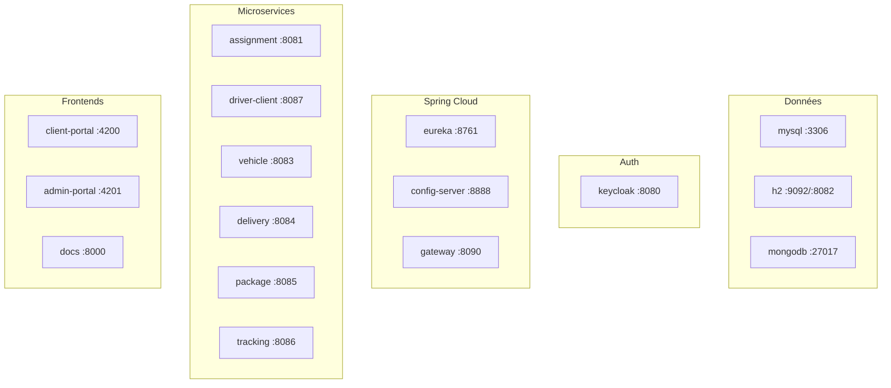

# Docker

Le fichier [`docker-compose.yml`](../docker-compose.yml) lance l'infrastructure complète : bases de données, Keycloak, Eureka, Config Server, Gateway, 6 microservices et les deux portails Angular.

## Architecture des conteneurs



## Inventaire

### Bases de données

| Conteneur | Image | Ports | Bases |
|-----------|-------|-------|-------|
| mysql | mysql:8.0 | 3306 | delivery_db, driver_client_db, package_db |
| h2 | oscarfonts/h2 | 9092 (TCP), 8082 (console) | assignment / vehicle (serveur H2) |
| mongodb | mongo:7 | 27017 | tracking_db |

Init MySQL : [`docker/mysql/init.sql`](../docker/mysql/init.sql)

### Authentification

| Conteneur | Image | Port | Notes |
|-----------|-------|------|-------|
| keycloak | quay.io/keycloak/keycloak:25.0 | 8080 | `start-dev --import-realm` ; realm [`docker/keycloak/deliverx-realm.json`](../docker/keycloak/deliverx-realm.json) |

Admin Keycloak : `admin` / `admin`

### Infrastructure Spring Cloud

| Conteneur | Build | Port | Dépendances |
|-----------|-------|------|-------------|
| eureka-server | `./eureka-server` | 8761 | — |
| config-server | `./config-server` | 8888 | eureka ; monte `config-repo` |
| gateway | `./GateWay` | 8090 | eureka, config, keycloak |

### Microservices

| Conteneur | Port hôte | Port interne | Dépendances principales |
|-----------|-----------|--------------|-------------------------|
| assignment-service | 8081 | 8081 | eureka, config |
| driver-client-service | **8087** | 8082 | mysql, eureka, config, keycloak |
| vehicle-service | 8083 | 8083 | eureka, config |
| delivery-service | 8084 | 8084 | mysql, eureka, config |
| package-service | 8085 | 8085 | eureka, config |
| tracking-service | 8086 | 8086 | mongodb, eureka, config |

### Frontends

| Conteneur | Dockerfile | Port |
|-----------|------------|------|
| client-portal | `frontend/Dockerfile.client` | 4200→80 |
| admin-portal | `frontend/Dockerfile.admin` | 4201→80 |

### Documentation

| Conteneur | Dockerfile | Port | URL |
|-----------|------------|------|-----|
| docs | `Dockerfile.docs` | 8000→80 | http://localhost:8000 |

Build multi-stage : `mkdocs build` (image Material) puis nginx pour servir le site statique.

## Réseau et volumes

- Réseau : `deliverx-network` (bridge)
- Volumes : `mysql_data`, `h2_data`, `mongodb_data`, `keycloak_data`, `vehicle_data`, `driver_client_data`, `driver_client_uploads`

## Commandes

```powershell
# Démarrer (build inclus)
docker compose up -d --build

# État
docker compose ps

# Logs d'un service
docker compose logs -f delivery-service

# Arrêt
docker compose down

# Arrêt + volumes
docker compose down -v

# Reconstruction complète
docker compose down -v
docker compose up -d --build --force-recreate
```

## Vérifier MySQL

```powershell
docker exec -it mysql mysql -u delivery_user -pdelivery_pass -e "SHOW DATABASES;"
```
